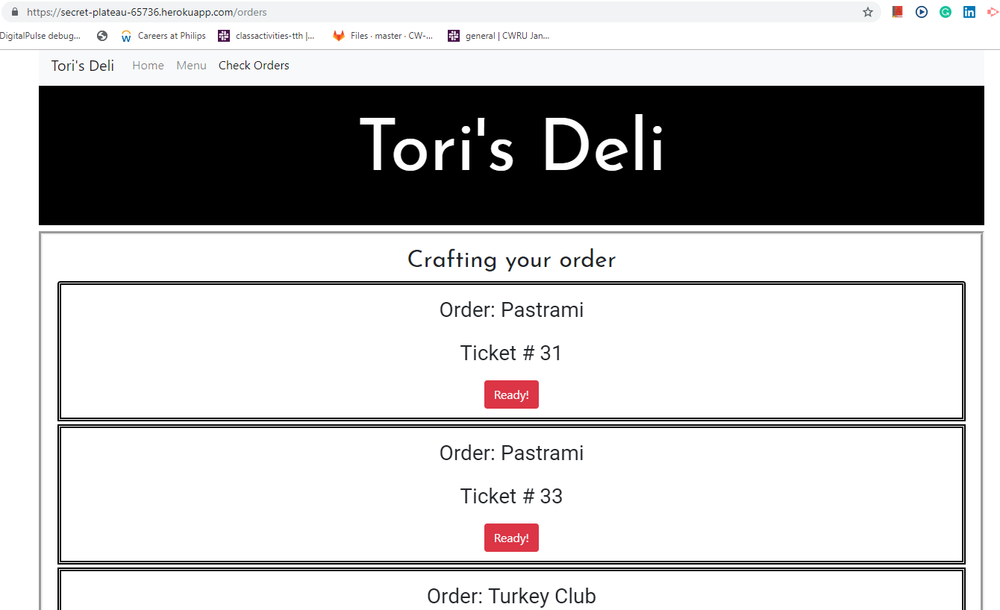

# ProjectTwo

# Description

This website is for a Deli. User is first navigated to home page. Homepage has links to menu and orders page. Screenshot is below:

When menu page is opened, Deli menu is displayed. Links to home, kitchen, and orders pages are provided. Screenshot is below.

When the user clicks on order button next to any sandwitch on the menu, modal page is opened with the order name and order number. Screenshot is below.

When the user opens the kitchen page and clicks on "Ready" button next to the item that is ready to be served, the order is removed from the queue on kitchen page and added to the orders page. Kitchen page is below.

When the user navigates to orders page. Queue of all sandwitches that are ready to be served are included with their names and ticket numbers. "Pick Up" button is present for every order. Screenshot is below.

When the user clicks on "Pick Up" button, the order is removed from queue.

# Creation Process

# Front End

html files were written using bootstrap, css, and handlebars. Animate.css was used to style the home page.

# Back End

Javascript files were written using npm packages including node.js, express, sequalize, and handlebars. MVC model was used including defined and using all CRUD API routes for mysql database, as well as html routes. All pages are mobile responsive.